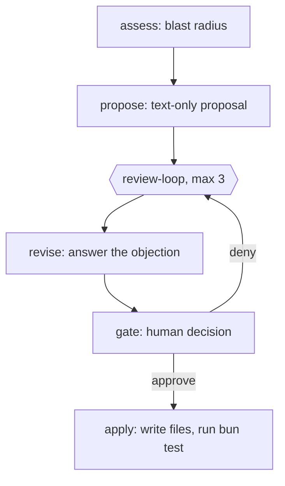

# Demo — durable human approval gate

Repo: `examples/pricing-api`. Workflow: `.smithers/workflows/price-change.tsx`
(id `price-change`). Run every command from `examples/pricing-api`.

## The flow



Five nodes: `assess`, `propose`, `review-loop` → (`revise`, `gate`), `apply`.
`propose` never writes to the repo. Only `apply` writes. That split is what makes
the decision reversible.

## Stage 1 — the deny path (the hero)

```bash
smithers up .smithers/workflows/price-change.tsx --detach
```
> "The agent reads the change request, then reads both callers of `quote()` to find
> the blast radius. It drafts a proposal. It does not touch the repo."

```bash
smithers ps
smithers why <run-id>
```
> "The run is not finished and it is not stuck. It is parked on a human. `why` names
> the exact gate it waits for."

```bash
smithers deny <run-id> --node gate --by leo --note "Mid-cycle accounts must keep the old price until renewal."
```
> "I reject it. The gate uses `onDeny=continue`, so my rejection and my note are
> written to the database as a decision row. The rejection is data, not a crash."

```bash
smithers up .smithers/workflows/price-change.tsx --run-id <run-id> --resume true
```
> "The run resumes inside the review loop. `revise` reads my note and drafts a new
> proposal that honours it, then the same gate asks me again."

## Stage 2 — the approve path

```bash
smithers why <run-id>
smithers approve <run-id> --node gate --by leo --note "Mid-cycle rule accepted."
smithers up .smithers/workflows/price-change.tsx --run-id <run-id> --resume true
```
> "Now I approve. Only now does `apply` run: it writes `src/pricing.ts`,
> `prices.json`, and a new `migrations/002_*.sql`, then runs `bun test` and reports
> the counts. Both consumer files still work."

```bash
smithers timeline <run-id>
smithers inspect <run-id>
```
> "The timeline shows both rounds: the proposal I rejected, my note, the revision,
> and the approval. Six months from now this is the audit trail for why the price
> changed."

## Bonus beat — a second gate on the migration

The schema migration has its own gate, off by default. Turn it on with an input flag:

```bash
smithers up .smithers/workflows/price-change.tsx --input '{"migrationGate":true}' --detach
smithers approve <run-id> --node gate --by leo
smithers up .smithers/workflows/price-change.tsx --run-id <run-id> --resume true
smithers deny <run-id> --node gate-migration --by leo --note "Ship the price now, schema next week."
smithers up .smithers/workflows/price-change.tsx --run-id <run-id> --resume true
```
> "Two gates, two owners. Pricing is approved, the schema change is held back, and
> `apply` ships only the price change."

## Offline fallback — no model calls needed

If the network or the model is unavailable, these four commands read local state
only and still tell the story:

```bash
smithers graph .smithers/workflows/price-change.tsx --compact   # renders the graph, exits 0
smithers ps                                                      # lists parked runs
smithers why <run-id>                                            # what the run waits for
smithers timeline <run-id>                                       # deny, revise, approve in order
smithers inspect <run-id>                                        # node states and outputs
```

`smithers graph` renders only the first frame, so it shows `assess` alone. That is
correct: the later nodes appear once their upstream outputs exist.
