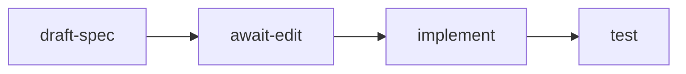

# Demo: the human edits the spec

## The repo

`todo-cli` is a 40-line todo CLI. `src/store.ts` holds a flat JSON array of
`{ id, title, done }` and reads its path from `TODO_FILE` at call time.
`src/cli.ts` exports `run(argv)` for `add`, `list`, and `done`. Six tests pass.

`FEATURE-REQUEST.md` asks for due dates and recurring todos. It also lists three
questions nobody has answered:

- Are due dates local time or UTC?
- When a recurring todo is completed, does the next instance appear immediately?
- Does `list` sort by due date or by id?

An agent cannot answer these from the code. A human must.

## The flow



| Node | Kind | What it does |
| --- | --- | --- |
| `draft-spec` | agent, `planning` | Reads the repo, writes a spec, lists what it could not decide |
| `await-edit` | `WaitForEvent` | Parks the run for up to 8 hours, waiting for the human's text |
| `implement` | agent, `implement` | Builds from the **edited** spec, migrating the store |
| `test` | agent, `validate` | Runs `bun test src` and reports the output verbatim |

The point is the edge from `await-edit` to `implement`. `implement` reads the wait
node's row, never the drafted one. The human's words are the build contract.

## Stage order

### 1 — Start the run detached

```sh
cd examples/todo-cli
smithers up .smithers/workflows/spec-then-build.tsx -d
```

> "That prints a run id and returns. The planning agent is now reading the repo."

### 2 — Open the custom UI

```sh
smithers ui            # newest run; or: smithers ui <run-id>
```

> "This page is not the Smithers dashboard. It ships with the workflow, in
> `.smithers/ui/spec-then-build.tsx`, and it is ~440 lines of shipped components."

Point at the header: connection state, elapsed, tokens, tests passing. Point at the
stage strip. `draft spec` reads done; the run is now sitting on `human edit`.

### 3 — Edit the spec live

The left pane is a real WYSIWYG markdown editor, seeded from the `draft-spec`
output. Scroll to **Open questions** and answer them in front of the room:

- Change "UTC or local — unresolved" to **"Store UTC, print local."**
- Change the recurrence question to **"The next instance appears immediately on
  completion, with the same id sequence continuing."**
- Change the sort question to **"`list` sorts by due date, undated todos last."**

Then add one line under **New tests**: `migrating a file with no due dates keeps
every id`.

> "I am not filing a ticket about this. I am editing the thing the agent is about
> to build from."

### 4 — Submit and resume

Press **Submit spec and resume**.

> "Two things just happened. The signal filled the parked node's row, and then
> the run resumed. A signal on its own does not wake a parked run — you need
> both calls, and the UI makes them in that order."

The stage strip moves to `implement`. Switch the right pane through its tabs:

- **Diff** — the implementation diff, file by file.
- **Tests** — the live `bun test` output, streaming into a terminal.
- **Agent chat** — every agent's live transcript. Click a node in **Nodes** to
  watch just that one.

### 5 — Land the point

```sh
smithers inspect <run-id>
```

Show the `await-edit` row next to the `draft-spec` row.

> "Two different documents. The agent wrote the first one. I wrote the second
> one. The code matches mine."

## Command-line fallback

The signal is an ordinary durable signal, so the UI is a convenience, not a
dependency. Both keys are required: the wait node resolves only when the signal
**name** and the **correlation id** both match.

```sh
smithers signal <run-id> spec.edited \
  --correlation spec-then-build-edit \
  --data '{"markdown":"# Spec\n\nDue dates are stored UTC and printed local.\n","editedBy":"leo"}'

smithers up .smithers/workflows/spec-then-build.tsx --run-id <run-id> --resume true
```

Omitting `--correlation` is the failure to know about: the gateway then defaults
the correlation id to the signal name, no waiter matches, and the run sits parked
looking healthy.

## Offline fallback

Every command below reads local state. None of them calls a model, so they work
with no network and on a finished run.

```sh
smithers graph .smithers/workflows/spec-then-build.tsx   # the static node graph
smithers timeline <run-id>                               # execution timeline and forks
smithers inspect <run-id>                                # full run state, every node row
smithers why <run-id>                                    # why a run is parked or blocked
```

If the projector network dies mid-demo, `smithers graph` still draws the
workflow and `smithers inspect` on a run recorded earlier still shows the drafted
spec and the edited spec side by side.
